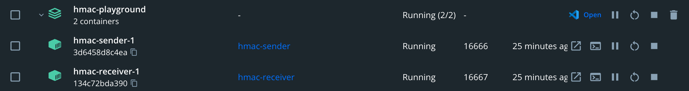

# HMAC Playground

```bash
❯ make help

Usage:
  make <target>

Targets:
  help                  지금 보고계신 도움말
  build                 빌드
  up                    실행
  down                  종료
  ps                    실행중인 컨테이너 확인
  logs                  로그 확인
```



sender와 receiver 서버를 실행합니다. 구성되어있습니다.

sender에서 생성한 메시지와 다이제스트를 receiver에게 전달하면 유효성 검증을 수행하고 결과를 반환합니다.
